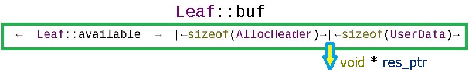
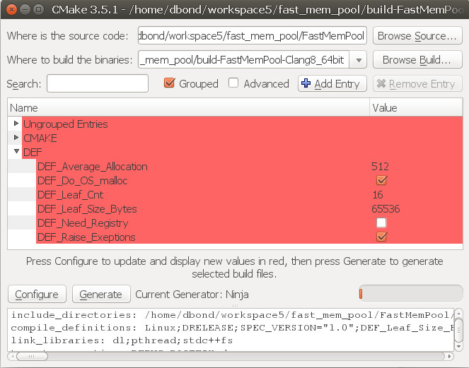
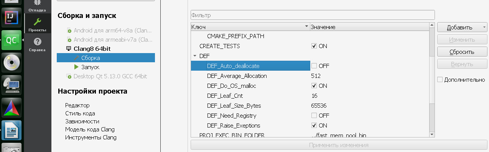
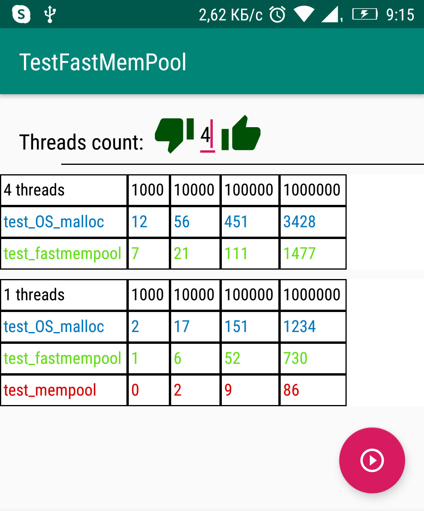

# FastMemPool
Fast thread-safe C++ recycler allocator with memory access control functions.
In the Release version it works without mutexes on circular memory pages with escalation to the OS malloc  if its buffers runs out.
Can be used as a replacement for std::allocator<T>  in STL containers.
All implementation in one header file:
[fast_mem_pool.h](https://github.com/DimaBond174/FastMemPool/blob/master/include/fast_mem_pool.h)

# Base usage
Instead of malloc() and free():

```c++

#include "fast_mem_pool.h"

int main(int argc, char** argv)
{
  FastMemPool<>  fastMemPool;
  void *ptr = fastMemPool.fmalloc(12345);
  fastMemPool.ffree(ptr);
}

```
See [test_base_usage.cpp](https://github.com/DimaBond174/FastMemPool/blob/master/tests/test_exe/src/cases/test_base_usage.cpp) full example.

# Checking access rights and buffer overflows
See full example here: [test_random_access1.cpp](https://github.com/DimaBond174/FastMemPool/blob/master/tests/test_exe/src/cases/test_random_access1.cpp)
The example uses the following methods:

```c++
// allocate RAM with aka malloc
//  + in Debug mode store info about line number
//   of code where this operation was called:
void  * ptr  =  FMALLOC(fastMemPool, size);

//Checking whether this is my allocation and whether
//I will go beyond the allocation limits if I perform an operation
// on this piece of memory:
if (FCHECK_ACCESS(fastMemPool, elem.array, &elem.array[elem.array_size - 1], sizeof (int))) {
  elem.array[elem.array_size - 1] = rand();
}

// free with checking if it has been freed twice:
FFREE(fastMemPool,  it.array);

```

Macros FMALLOC, FFREE, FCHECK_ACCESS are used to automatically switch between Debug and Release versions of methods.
The Debug version saves information about the place of allocation / deallocation (__FILE__, __LINE__, __FUNCTION__).
This makes it easy to track where a repeated deallocation or access to wrong memory area occurred.

The FastMemPool recognizes its memory and its size by the AllocHeader that is included in each allocation:



```c++
struct AllocHeader {
  /*
   label of own allocations:
   tag_this = (uint64_t)this + leaf_id */
  uint64_t  tag_this  {  2020071700  };
  // allocation size (without sizeof(AllocHeader)):
  int  size;
  // allocation place id (Leaf ID  or OS_malloc_id):
  int  leaf_id  {  -2020071708  };
};
```

# Advanced usage
Template FastMemPool has next compile time parameters:

```c++

template<int Leaf_Size_Bytes = DEF_Leaf_Size_Bytes, int Leaf_Cnt = DEF_Leaf_Cnt,
  int Average_Allocation = DEF_Average_Allocation, bool Do_OS_malloc = DEF_Do_OS_malloc,
  bool Raise_Exeptions = DEF_Raise_Exeptions>
class FastMemPool
{
};

int Leaf_Size_Bytes;\\ = What size will each memory leaf be in a circular allocator?
int Leaf_Cnt;\\ = How many leafs of memory will run in a loop?
int Average_Allocation;\\ = At what level of the remaining memory is the leaf considered depleted and the current leaf is switched
bool Do_OS_malloc;\\ = If all leafs are exhausted, then whether to ask for memory from the OS malloc?
bool Raise_Exeptions;\\ = In case of an error, throw std::range_error() or do nothing silently
DEF_Auto_deallocate = if defined, all allocations will be stored and freed on FastMemPool destruction
```

It is convenient to set defaults for these parameters via CMake GUI:


or via Qt Creator:


For example, if you are processing video, frames are processed by several threads, but the threads do not have time to process the incoming frames.
Then, in order not to out of computer memory, you skip frames that you do not have time to process.
It is convenient to control this through the FastMemPool allocator, indicating that you cannot allocate from the OS malloc - then if FastMemPool returns nullptr, then the video frame should be skipped.
```c++

using  TVideoPool = FastMemPool<100000, 10, 1000, false, false>;

```
See [test_memcontrol1.cpp](https://github.com/DimaBond174/FastMemPool/blob/master/tests/test_exe/src/cases/test_memcontrol1.cpp) full example.

# STL usage
There is one more template FastMemPoolAllocator that extends the standard class STL std::allocator<T>.
This allows you to use FastMemPool for:
- to allocate memory and construct objects on it:
```c++

FastMemPoolAllocator<std::string> myAllocator;
std::string* str = myAllocator.allocate(3);
myAllocator.construct(str, "Mother ");
myAllocator.construct(str + 1, " washed ");
myAllocator.construct(str + 2, "the frame");

```
See both methods bool test_Template_method() and bool test_Strategy() in [test_allocator1.cpp](https://github.com/DimaBond174/FastMemPool/blob/master/tests/test_exe/src/cases/test_allocator1.cpp) full example.

- to use inside STL containers:
```c++

// compile time inject FastMemPoolAllocator:
std::unordered_map<int,  int, std::hash<int>, std::equal_to<int>, FastMemPoolAllocator<std::pair<const int,  int>> >  umap1;

// runtime inject FastMemPoolAllocator:
std::unordered_map<int,  int>  umap2(1024, std::hash<int>(), std::equal_to<int>(),  FastMemPoolAllocator<std::pair<const int,  int>>());

```
See [test_stl_allocator2.cpp](https://github.com/DimaBond174/FastMemPool/blob/master/tests/test_exe/src/cases/test_stl_allocator2.cpp) full example.

# Use to protect against buggy programmers
Use the FastMemPool to shift your wonderful structures so that someone else's buffer overflow is guaranteed not to hit you:


For example so:
```c++

FastMemPool<100000000, 1, 1024, true, true>  bulletproof_mempool;
void *ptr = bulletproof_mempool.fmalloc(1234567);
bulletproof_mempool.ffree(ptr);

```

# Android test
Source codes for Android test: [FastMemPool on Android](https://github.com/DimaBond174/test_android_FastMemPool)

Test results on the ARM processor:

